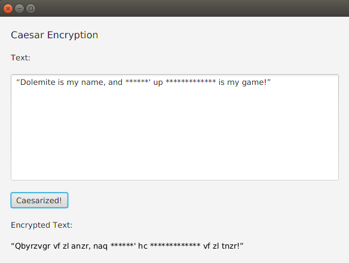

<h1>Caesar Encryption</h1>

<h3>Description</h3>
A personal project. The app is using JavaFx GUI and basic fucntionality is to encrypt given text with key of random int between 1 - 26.
Example:
Original word: 'a'
Random key: 2
Ecncrypted word: 'c'

a + 2 = c.

it will only encrypt alphabets.

Example of GUI:
 

<h3>Future Development</h3>
<ul>
<li>Caesar Decryption</li>
<li>Improved GUI</li>
